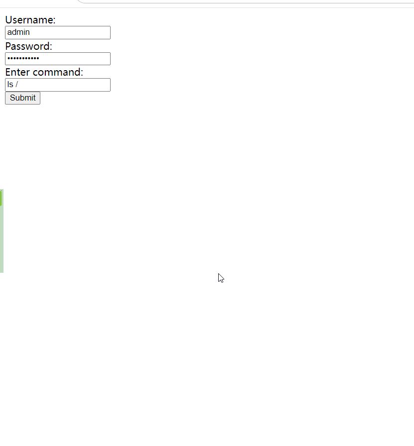

本来只是想在手机上方便重启 容器alist ，实际分析了很多方法都不满意

1. 比如在手机上安装群晖的管家App，竟然没有管理容器的功能
2. 手机上登录 Portainer ，安全性是大问题，没找到合适的外网二次验证方案
3.  ssh 远程执行命令，需要在命令行中提供管理员密码，不安全，另外，win7也不支持
4.  群晖上的win7挂微信，里面设置一个chrome环境专门登录Portainer，因为配置较低，测试时候导致chrome奔溃，看来该方式也不合适
5. 用配置更高的win系统虚拟机登录一个chrome浏览器窗口并且登录了Portainer，方案肯定可行，就是为1个月才能用到一次的功能，运行一台虚拟机，不划算

最后想到了 webshell ，带上账号验证，安全性也有保障，功能也更灵活，不止是重启容器， 重启服务器也难不倒我:)

运行效果


```buildoutcfg
./webshell-py  -u myuser -pw mypassword -host 0.0.0.0 -port 8080
./webshell-go  -u myuser -pw mypassword -host 0.0.0.0 -port 8080
```

### python 版本
python版本程序很快就让chatgpt写好，下面就开始在linux下编译，一开始用python3.8 ，安装依赖，pyinstaller 打包，结果运行时候提示 
```
[32574] Error loading Python lib '/tmp/_MEIwRHOOd/libpython3.8.so.1.0': dlopen: /lib64/libm.so.6: version `GLIBC_2.29' not found (required by /tmp/_MEIwRHOOd/libpython3.8.so.1.0)
```

这个错误表明您的 Python 程序试图加载一个 `libpython3.8.so.1.0` 库文件，但它需要的 `GLIBC_2.29` 版本在当前系统中不可用。

这通常是因为您在一个较老版本的系统上构建了一个依赖于较新版本 GLIBC 的二进制文件。GLIBC 是 GNU C 函数库，它提供了许多 C 语言函数的实现，Python 解释器也是用 C 语言编写的，因此 Python 解释器和其相关的库也依赖于 GLIBC。

解决这个问题的一种方法是在构建二进制文件时使用与目标系统兼容的更旧版本的 GLIBC。这可能需要在 Docker 容器中进行构建，以确保二进制文件与目标系统的环境匹配。

另一种方法是将您的 Python 程序打包为 Docker 镜像，并在运行时在含有正确 GLIBC 版本的环境中运行。这样，您可以确保您的程序与 GLIBC 的版本兼容。

最后，您还可以尝试在目标系统上安装 GLIBC 2.29 或更高版本。但请注意，更改系统级库可能会对系统的稳定性产生影响，因此建议在受控环境中进行此类更改。

于是开始找低版本的python环境，最后是这个成功了


新建目录webshell ，创建 requirements.txt
```
flask
pyinstaller
```

创建文件， webshell.py 内容如下
```
from flask import Flask, request, Response
import argparse
import subprocess

app = Flask(__name__)

# 全局变量，用于存储命令行参数
args = None

def authenticate(username, password):
    # 这里可以根据自己的需求来进行身份验证，例如检查用户名和密码是否匹配数据库中的记录
    return username == args.username and password == args.password

@app.route("/", methods=["GET", "POST"])
def index():
    if request.method == "POST":
        username = request.form.get("username")
        password = request.form.get("password")
        command = request.form.get("command")
        
        if authenticate(username, password):
            result = subprocess.Popen(command, shell=True, stdout=subprocess.PIPE, stderr=subprocess.PIPE)
            output, error = result.communicate()
            return "<pre>{}</pre>".format(output.decode() + error.decode())
        else:
            return Response("Unauthorized", 401)
    else:
        return '''
        <form method="post">
            <label for="username">Username:</label><br>
            <input type="text" id="username" name="username"><br>
            <label for="password">Password:</label><br>
            <input type="password" id="password" name="password"><br>
            <label for="command">Enter command:</label><br>
            <input type="text" id="command" name="command"><br>
            <input type="submit" value="Submit">
        </form>
        '''

if __name__ == "__main__":
    parser = argparse.ArgumentParser(description="Simple Webshell")
    parser.add_argument("-host", "--host", type=str, default="0.0.0.0", help="Host ip to run the server on")
    parser.add_argument("-port", "--port", type=int, default=8080, help="Port to run the server on")
    parser.add_argument("-u", "--username", type=str, default="admin", help="Username for authentication")
    parser.add_argument("-pw", "--password", type=str, default="password", help="Password for authentication")
    args, _ = parser.parse_known_args()
    
    # 运行 Flask 应用
    app.run(debug=True, host=args.host, port=args.port)

# 2024.03.30
# docker run -v "$(pwd):/src/" obenn/pyinstaller-linux:python3.7-64bit-precise "pyinstaller --onefile webshell.py"
#  ./dist/webshell  --host 192.168.1.10 -port 8080
```

```shell
docker run -v "$(pwd):/src/" obenn/pyinstaller-linux:python3.7-64bit-precise "pyinstaller --onefile webshell.py"

```
二进制文件10.6MB ，python 真的不适合打包， 打包好的文件大不说，运行后在系统里创建了4个进程，太夸张。

###  go版本

直接让chatgpt把上面代码转为go，

webshell.go
```
package main

import (
	"flag"
	"fmt"
	"log"
	"net/http"
	"os/exec"
)

func authenticate(r *http.Request, username, password string) bool {
	return r.FormValue("username") == username && r.FormValue("password") == password
}

func indexHandler(w http.ResponseWriter, r *http.Request, username, password string) {
	if r.Method == "POST" {
		if authenticate(r, username, password) {
			command := r.FormValue("command")
			cmd := exec.Command("bash", "-c", command)
			output, err := cmd.CombinedOutput()
			if err != nil {
				fmt.Fprintf(w, "Error: %s\n", err)
				return
			}
			w.Header().Set("Content-Type", "text/plain") // 设置响应头
			fmt.Fprintf(w, "%s", output)
		} else {
			http.Error(w, "Unauthorized", http.StatusUnauthorized)
		}
	} else {
		w.Header().Set("Content-Type", "text/html") // 设置响应头
		fmt.Fprintf(w, `
		<html>
		<head><title>Webshell</title></head>
		<body>
			<form method="post">
				<label for="username">Username:</label><br>
				<input type="text" id="username" name="username"><br>
				<label for="password">Password:</label><br>
				<input type="password" id="password" name="password"><br>
				<label for="command">Enter command:</label><br>
				<input type="text" id="command" name="command"><br>
				<input type="submit" value="Submit">
			</form>
		</body>
		</html>
		`)
	}
}

func main() {
	var (
		username string
		password string
		host     string
		port     string
	)

	flag.StringVar(&username, "u", "admin", "Username for authentication")
	flag.StringVar(&password, "pw", "password", "Password for authentication")
	flag.StringVar(&host, "host", "0.0.0.0", "Host ip to run the server on")
	flag.StringVar(&port, "port", "8080", "Port to run the server on")

	flag.Parse()

	http.HandleFunc("/", func(w http.ResponseWriter, r *http.Request) {
		indexHandler(w, r, username, password)
	})

	log.Printf("Server running on %s:%s...\n", host, port)
	log.Fatal(http.ListenAndServe(host+":"+port, nil))
}

```

Dockerfile
```
FROM golang:1.18 AS builder

WORKDIR /build

ENV CGO_ENABLED 0
ENV GOPROXY https://goproxy.cn,direct

ADD go.mod .
COPY . .
RUN go build -o webshell webshell.go

RUN ls -all
CMD ["./webshell"]
```
